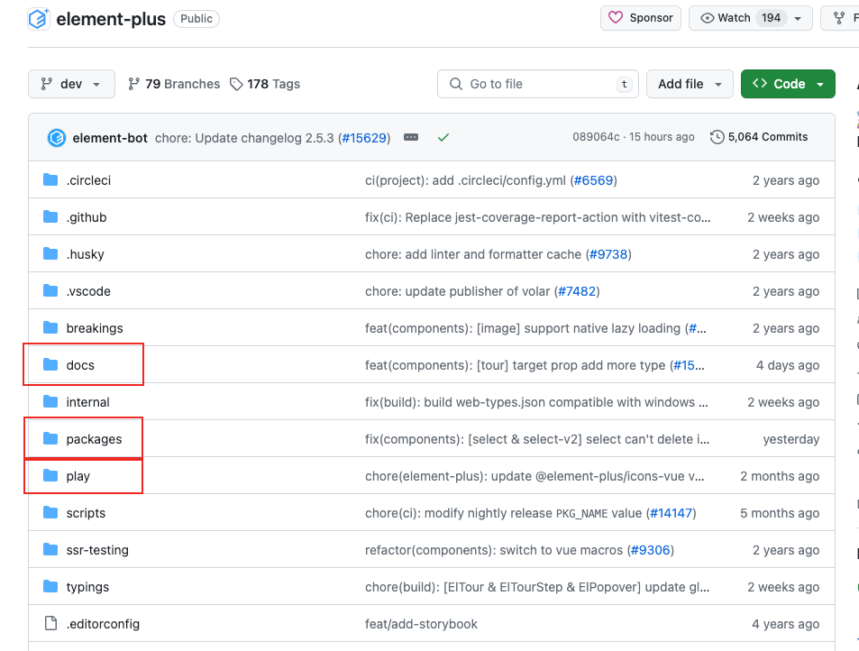

# private

表示是否是私有包，如果private为true，则该包不会被发布。
在搭建monorepo项目时，一般基座项目会把private设为true。

# workspace

用于在monorepo项目中指明工作区目录

```tsx
//element-plus
{
  //指明有哪些子项目
  "workspaces": [
    //components&hooks&utils...
    "packages/*",
    //调试项目
    "play",
    //文档
    "docs"
  ]
}
```

