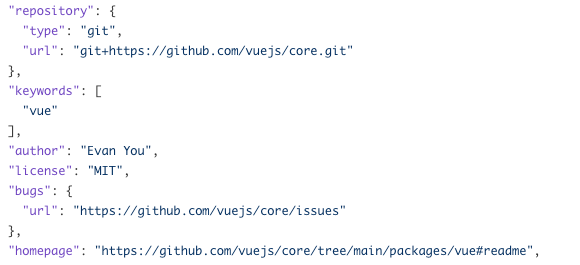

# 其他基础字段

## description

一句话来描述这个包是做什么的

```json
//react
"description": "React is a JavaScript library for building user interfaces."
//vue
 "description": "The progressive JavaScript framework for building modern web UI."
//ts
"description": "TypeScript is a language for application scale JavaScript development"
```

## keywords

数组或字符串来指明关键词，用于npm搜索

```json
//ts
"keywords": [
    "TypeScript",
    "Microsoft",
    "compiler",
    "language",
    "javascript"
]

//react
"keywords": [
    "react"
]

//vue
"keywords": [
    "vue"
]
```

## author

包作者

## license

开源协议

## repository

代码仓库

## homepage

项目主页

## bugs

示例：vue的package.json

