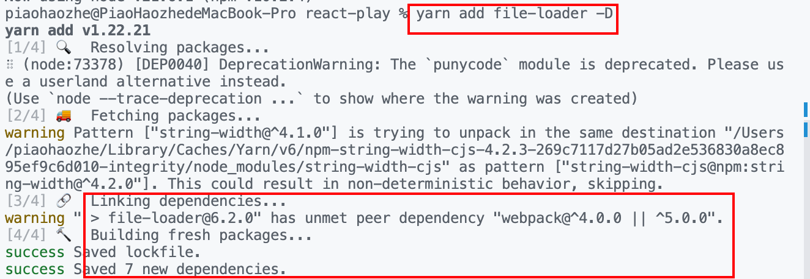

# 各种dependencies

### devDependencies

表示开发工具依赖，通常是构建工具，类型声明，编译器，测试框架等。它们不应该出现在打包产物中。

### dependencies

表示包依赖，通常是开发框架的运行时，polyfill，工具函数等，代码必须依赖这些包才能正常运行。

类似的有**[optionalDependencies](https://docs.npmjs.com/cli/v10/configuring-npm/package-json#optionaldependencies)，**表示如果这些依赖项无法安装或者在某些环境下不可用，整个包依然可以继续安装和运行。

### peerDependencies

表示同级依赖。指引用你的包的项目必须安装了哪些依赖。比如组件库的发包不需要把框架打包进去，但运行组件库必须要相同的框架。那么该框架与组件库就应该是同级依赖。

```tsx
//file-loader的package.json

 "peerDependencies": {
    "webpack": "^4.0.0 || ^5.0.0"
  },
  "dependencies": {
    "loader-utils": "^2.0.0",
    "schema-utils": "^3.0.0"
  }
```

如果没有安装同级依赖，在yarn 1.22.21版本下会给出警告。但仍然会成功安装且同级依赖不会被强制安装。



如果想让某些同级依赖可选，可以这样


> 通常情况下，同级依赖是被认为是必需的依赖，将其标记为可选，这可能是因为：
> 

> **兼容性问题**：某些同级依赖可能只在特定的环境或平台下才需要，如果用户不需要或不支持这些特定的功能，将其标记为可选可以避免不必要的安装。
> 

> **功能扩展**：同级依赖可能是用于扩展您的包的可选功能，如果用户不需要这些功能，可以选择不安装这些同级依赖。
> 

> **减少依赖链**：有时将同级依赖标记为可选可以减少整个依赖链的复杂性和安装时间，因为用户可能不需要这些依赖项。
> 
> 
>                                                                                                                                     — chatGpt