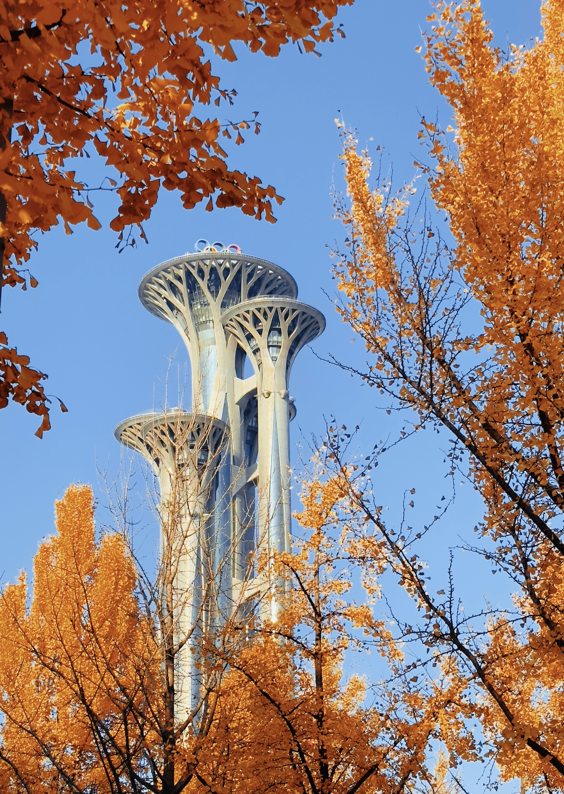

# `sideEffects` 与摇树优化丢失问题



> 秋天的奥林匹克森林公园

## 问题背景

在项目中引入 `lodash` 后，通过分析打包资源发现 `lodash` 的体积过大。为了优化包体积，我们决定通过配置 `package.json` 中的 `sideEffects` 字段来启用摇树优化（Tree Shaking）。

然而在启用摇树优化后，出现了两个问题：
1. CSS 样式丢失
2. 部分 JS 模块未被执行

## 解决方法

### CSS 样式丢失的解决方案

在 `package.json` 中将 CSS 文件标记为有副作用：

```json
"sideEffects": [
    "**/*.css"
]
```

### JS 模块未执行的解决方案

对于没有导出任何内容（没有 `export`）但需要被执行的模块，需要将其添加到 `sideEffects` 配置中：

```json
"sideEffects": [
    "./src/utils/resetFontSize.ts"
]
```

## 摇树优化原理

`sideEffects` 字段用于标记哪些文件具有副作用。打包工具在进行摇树优化时，主要遵循以下步骤：

1. 基于 `ESModule` 进行静态分析，识别未被引用的模块
2. 判断模块是否有副作用，无副作用则可以安全删除
3. 怎么知道有没有副作用呢？一方面 `webpack` 依赖的 `terser` 会去检测语句中的副作用（但 JS 作为动态类型语
言，很多情况下不执行是分析不出结果的，所以语句层面的副作用分析能力有限，可以通过魔法注解 `/*#__PURE__*/` 来
配合，旨在标明该声明无副作用），另一方面我们可以在 `sideEffects` 配置项中告诉打包工具哪些文件是有副作用的，
即允许打包工具应该跳过对整个模块及其子树的分析。，很多情况下静态分析无法准确判断副作用。可以使用魔法注释 `/*#__PURE__*/` 来辅助标记无副作用的代码。

## 实际案例

以下是一个典型的问题示例：

```typescript
// resetFontSize.ts
import { detectDeviceType } from './deviceUtils';
  
(function flexible(window: Window, document: Document) {
    function resetFontSize() {
        const clientWidth = parseInt(
            document.documentElement.clientWidth.toString(),
            10
        );
        let size = 0;
        // 使用 detectDeviceType 函数判断设备类型
        if (detectDeviceType() === 'desktop') {
            size = (document.documentElement.clientWidth / 1920) * 16;
            document.documentElement.style.fontSize = (size <= 14 ? 13 : size) + 'px';
        } else {
            size = clientWidth;
            const fontSize = (size / 750) * 16;
            document.documentElement.style.fontSize = fontSize + 'px';
        }
    }

    resetFontSize();
    window.addEventListener('pageshow', resetFontSize);
    window.addEventListener('resize', resetFontSize);
})(window, document);

// index.ts
import '@utils/resetFontSize';
```

虽然 `index.ts` 中引用了 `resetFontSize`，但由于该模块没有任何 `export`，摇树优化会将其删除。解决方案是在 `sideEffects` 中声明：

```json
// package.json
"sideEffects": [
    "./src/utils/resetFontSize.ts"
]
```

### Vue 项目的特殊处理

对于 Vue 项目，如果组件中包含样式，需要特别处理：

```json
// package.json
"sideEffects": [
    "**/*.css",
    // 标记包含样式的 Vue 组件
    "./src/ComponentWithStyle.vue"
]
```

另外，也可以选择完全禁用摇树优化，即[从 `package.json` 中移除 `"sideEffects": false`](https://vue-loader.vuejs.org/guide/#manual-setup)。

## 最佳实践

为了更好地利用摇树优化：
1. 优先使用支持 ES 模块的包版本，如使用 `lodash-es` 替代 `lodash`
2. 对于必要的副作用代码，明确在 `sideEffects` 中声明
3. 合理使用 `/*#__PURE__*/` 注释标记无副作用的代码
