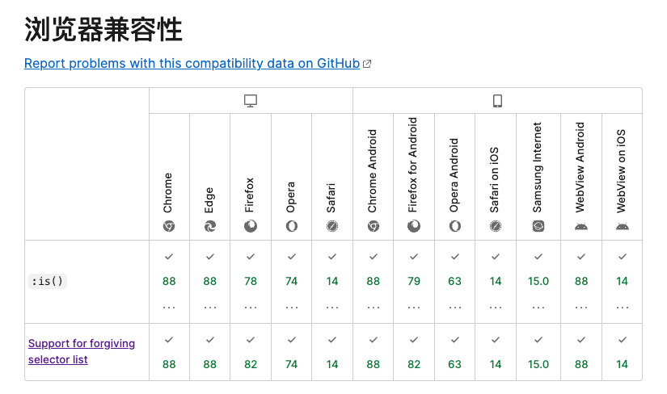

# 【汇总】常见的一些兼容性问题

在网页开发过程中常常需要适配移动端应用的 `webview` 和万恶的微信内置浏览器。

- 苹果端的`webview`的特点是：大多数设备浏览器内核版本统一。但有一些苹果自己加入的"独占特性"——偶尔一些行为和`pc`端表现不一致。

- 安卓端的`webview`的特点是：大多数设备浏览器内核版本**不**统一。但大多情况下和`pc`端表现一致。
- 微信内置浏览器：大多数设备浏览器内核版本统一，但有阉割和"新特性"引入、经常和`pc`端表现不一致。

浏览器内核版本统一通常意味着：该平台自动更新做的到位、用户浏览器内核版本普遍很高。对现代浏览器的新特性普遍支持。开发起来会比较舒服。

和`pc`端表现不一致通常意味着：在该平台执行代码可能出现意料之外的行为、且不好调试、难于排查。

接下来是一些兼容性问题及解决方法的汇总。

### `Safari` 默认不支持 `requestIdleCallback`

只是默认情况下不支持，用户可以手动打开。（但我们不能要求用户去这么做，所以只能避免使用该`api`）


## `ios Safari` 唤起下载

`ios`端的`Safari`下载`pdf`等可以在浏览器打开的文件时，`Safari`更倾向于原地打开，而不是唤起下载。

```js
const iosDownload = url => {
  fetch(url)
    .then(res => res.blob())
    .then(blobRes => {
      // 额外套一层blob是为了强制触发下载行为，而不是预览
      const blob = new Blob([blobRes]);
      const url = URL.createObjectURL(blob);
      const aEl = document.createElement('a');
      aEl.href = url;
      aEl.download = `${title}.pdf`;
      aEl.target = '_blank';
      document.body.appendChild(aEl);
      aEl.click();
      document.body.removeChild(aEl);
      URL.revokeObjectURL(url);
      hideTextTip();
    });
};
```

## `tailwind` 默认使用 `is` 选择器

`tailwind` 编译结果含 `is` 选择器，`is`选择器需要浏览器内核版本偏高。会导致旧设备下无样式。



解决方法：安装 `postcss-pseudo-is`


## 底部按钮的定位与键盘呼出

按钮固定到屏幕底部是常见的需求，通常`position: fix;`即可。

但部分安卓设备弹出键盘时会缩小窗口高度导致固定底部的按钮跟着上来，使本来就不大的窗口里只剩个按钮了。

解决思路是监听窗口`resize`事件，在窗口缩小和放大时改变按钮的定位。

```js
//按钮的定位 = buttonSticky ? 'sticky' : 'static'

let buttonSticky = false;
//先记录窗口高度
const winHeight = document.documentElement.clientHeight;

window.addEventListener("resize", function () {
  //发现窗口高度变小了
  if (document.documentElement.clientHeight < winHeight) {
    console.log("检测到窗口缩小了,可能是键盘呼出了");
    buttonSticky = false;
  } else {
    console.log("窗口放大了,可能是键盘关闭");
    buttonSticky = true;
  }
});
```

## 微信浏览器与图片保存

微信浏览器 `a` 标签下载 `base64` 图片遇到兼容问题，可能无法正常下载。

微信浏览器中，图片下载通常用长按保存图片的方式来实现。

## 添加到剪贴板的兼容性代码

`clipboard API`对执行环境有两点要求：

1. 浏览器内核版本(chrome 66+)
2. [安全上下文](https://developer.mozilla.org/zh-CN/docs/Web/Security/Secure_Contexts)

所以有了如下的兼容代码：

```javascript
const setClipboard = (text: string, cb?: () => void) => {
  navigator.clipboard
    .writeText(text)
    .then(() => {
      cb?.();
    })
    .catch((err) => {
      console.error("Async: Could not copy text: ", err);
      //for compatibility
      const input = document.createElement("input");
      input.value = text;
      input.style.position = "fixed";
      input.style.opacity = "0";
      document.body.appendChild(input);
      input.select();
      document.execCommand("copy");
      document.body.removeChild(input);
      cb?.();
    });
};

export default setClipboard;
```

## h5隐藏滚动条

PC端的滚动条可以通过以下方式隐藏：

```css
-webkit-scrollbar {
  width: 0;
  height: 0;
}
```

但手机端不能。手机端需要通过以下方式隐藏：

- 但`Safari`浏览器似乎无论如何都不能完全隐藏滚动条：

```css
-webkit-scrollbar {
  display: none;
}
```

如果需要显示可以使用 unset 关键字。

## `Safari GET`请求丢参数的坑


如图，上面是`Safari`，下图是`chrome`。

当然问题在于该接口的设计，导致参数携带不符合规范的"-"。

`chrome`在面对这种不规范的`queryString`时会特殊处理，但`Safari`会直接把这部分参数丢掉。

## `Safari` 丢失分割线

苹果设备(`ios`/`mac`)在渲染很细的分割线时，偶发的渲染不出来。

这里面分两种情况：

	1. 外接屏分辨率较低。
	1. 开启了 `px2rem` 来做屏幕适配，`post-css` 把 `1px` 的边框编译成了零点零几 `rem`。

第一种情况除了增粗边框外比较无解。也比较怪异: 在`mac`内建屏幕显示正常，在外接屏幕里就会丢失细节。在两个屏幕之间来回拖动窗口窗口会导致边框时有时无。可能和`mac`的图形渲染逻辑有关。

第二种情况可以在`post-css`的配置文件里做相关配置，不编译`border`的像素值。

## `Safari`的`input`

最小复现`demo`:

```tsx
import { Input } from "@mui/material";
import { useEffect } from "react";

export default function MyTest() {
  useEffect(() => {
    document.documentElement.style.fontSize = "4px";
  }, []);

  return (
    <>
      raw : <input type="text" className="w-[25rem]" />
      mui : <Input className="w-[25rem]"></Input>;
    </>
  );
}
```

用 `iphone` 的 `Safari` 打开该页面，`input` 框的光标会靠左偏移。

可能是因为根元素的字体小于 `12px`，越小 `bug` 越明显。所以解决方案就是别让 `html` 的字体太小。


## `theme-color`

`Safari`支持`theme-color`，但`chrome`似乎不支持。

举个例子，当`Safari`浏览优酷时，整个窗口都会变黑。


接下来是`mdn`的示例：


## 微信浏览器下载`PDF`

需求是在微信浏览器下载`pdf`。

产品所说的下载是指下载到设备本地，而不是自动打开。

### 安卓端

如果通过 `js` 下载 `blob`，然后再通过 `a` 标签触发下载，在安卓端会提示:'请打开浏览器下载'。但是，在浏览器中地址栏是 `blob` 地址，无法完成下载。
解决方法：

```js
window.open(url, "_blank");
```

### 苹果端

如果在苹果端直接 `window.open` 则会直接打开 `pdf`的预览，而不是所谓��下载。
解决方式是通过 `js` 转 `blob` 的方式实现下载
解决方法:

```javascript
fetch(url)
  .then((res) => res.blob())
  .then((blobRes) => {
    // const blob = new Blob([blobRes]);
    // 解开这行能在ios_safari触发下载行为 ???
    const blob = blobRes;
    const url = URL.createObjectURL(blob);
    const aEl = document.createElement("a");
    aEl.href = url;
    aEl.download = `${title}.pdf`;
    aEl.target = "_blank";
    document.body.appendChild(aEl);
    aEl.click();
    document.body.removeChild(aEl);
    URL.revokeObjectURL(url);
  });
```


