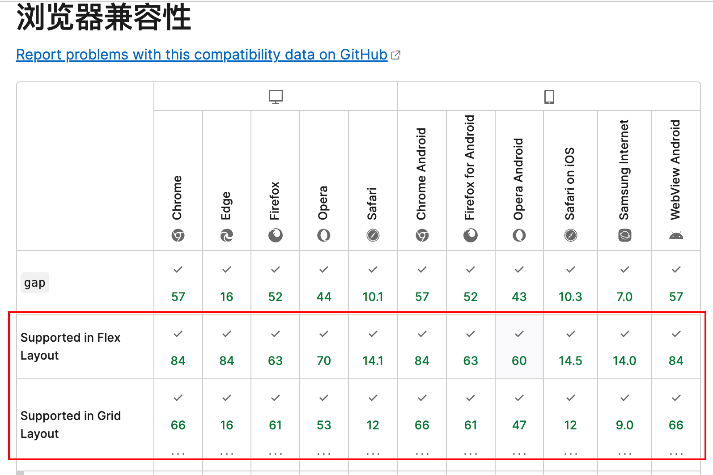

# 在 flex 中用 gap

> 秋天的百望山

在容器中排列若干子项，通常我们会用 `flex` 布局配合子项的`margin` 来让子项有间距的排列在容器内。

但这样会导致每一行的最后一项和最后一行有多余的`margin`冗余。

## flex-gap

但其实在`flex` 布局内可以用`gap`，来轻松指定内部项的排列，不再需要手动给 `margin`。

在 `tailwind` 里可以很直观的使用 `gap-x-[10px] gap-y-[10px]` 来简单优雅的给子项设定间距。

## 兼容性的坑

有趣的是，我们习惯用`flex` 而不用 `grid`布局的原因是普遍认为`flex`兼容性好于`grid`。

但 `gap` 属性在`grid` 布局中的兼容性比在`flex`布局中的兼容性要好。

## 后记

最近为了兼容老设备,不得不把组件库中的`flex`布局中的 `gap`手动改为 `margin` 😭
