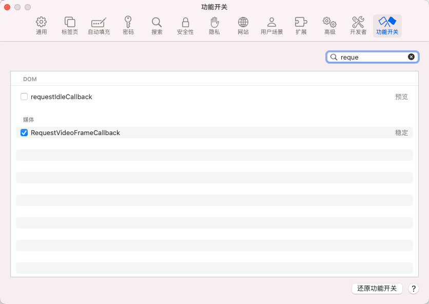

# 常见的一些兼容性问题汇总

在网页开发过程中常常需要适配 ios/android 的 webview 和万恶的微信内置浏览器，所以在这里记录一些 coding 中碰到的兼容性问题。

### safari 默认不支持 requestIdleCallback

只是默认情况下不支持，用户可以手动打开。不知道为什么 apple 不让默认打开



## ios safari 唤起下载

```
const iosDownload = url => {
  fetch(url)
    .then(res => res.blob())
    .then(blobRes => {
      // 解开下行注释就可以在ios Safari上唤起下载 , ???
      // const blob = new Blob([blobRes]);
      const blob = blobRes;
      const url = URL.createObjectURL(blob);
      const aEl = document.createElement('a');
      aEl.href = url;
      aEl.download = `${title}.pdf`;
      aEl.target = '_blank';
      document.body.appendChild(aEl);
      aEl.click();
      document.body.removeChild(aEl);
      URL.revokeObjectURL(url);
      hideTextTip();
    });
};
```

## tailwind 默认使用 is 选择器

tailwind 编译结果含 is 选择器

解决方法：安装 `postcss-pseudo-is`

## 定位与键盘弹出

部分安卓设备弹出键盘时会修改窗口高度导致固定底部的按钮跟着上来

```js
//按钮的定位 = buttonSticky ? 'sticky' : 'static'

let buttonSticky = false;
//先记录窗口高度
const winHeight = document.documentElement.clientHeight;

window.addEventListener("resize", function () {
  //发现窗口高度变小了
  if (document.documentElement.clientHeight < that.winHeight) {
    console.log("检测到窗口缩小了,可能是键盘呼出了");
    that.buttonSticky = false;
  } else {
    console.log("窗口放大了,可能是键盘关闭");
    that.buttonSticky = true;
  }
});
```

## 微信浏览器与图片保存

微信浏览器 a 标签下载 base64 图片遇到兼容问题

可能无法正常下载。图片下载通常用长按保存图片来实现。

### 添加到剪贴板的兼容性代码

```javascript
const setClipboard = (text: string, cb?: () => void) => {
  navigator.clipboard
    .writeText(text)
    .then(() => {
      cb?.();
    })
    .catch((err) => {
      console.error("Async: Could not copy text: ", err);
      //for compatibility
      const input = document.createElement("input");
      input.value = text;
      input.style.position = "fixed";
      input.style.opacity = "0";
      document.body.appendChild(input);
      input.select();
      document.execCommand("copy");
      document.body.removeChild(input);
      cb?.();
    });
};

export default setClipboard;
```

### h5隐藏滚动条

pc的滚动条可以通过这样隐藏:

```css
-webkit-scrollbar {
  width: 0;
  height: 0;
}
```

但手机端不能。手机端得通过来隐藏。

```css
-webkit-scrollbar {
  display: none;
}
```

如果需要显示可以使用 unset 关键字。
