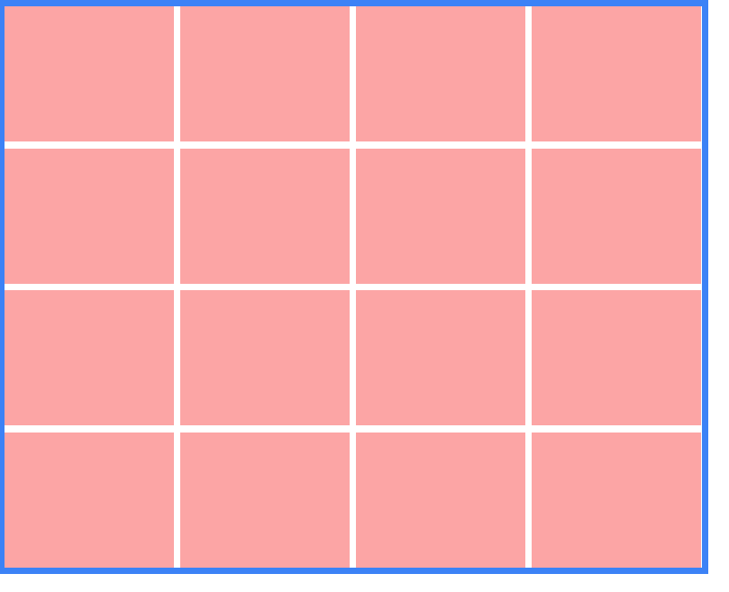
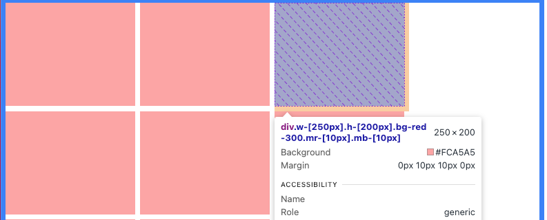
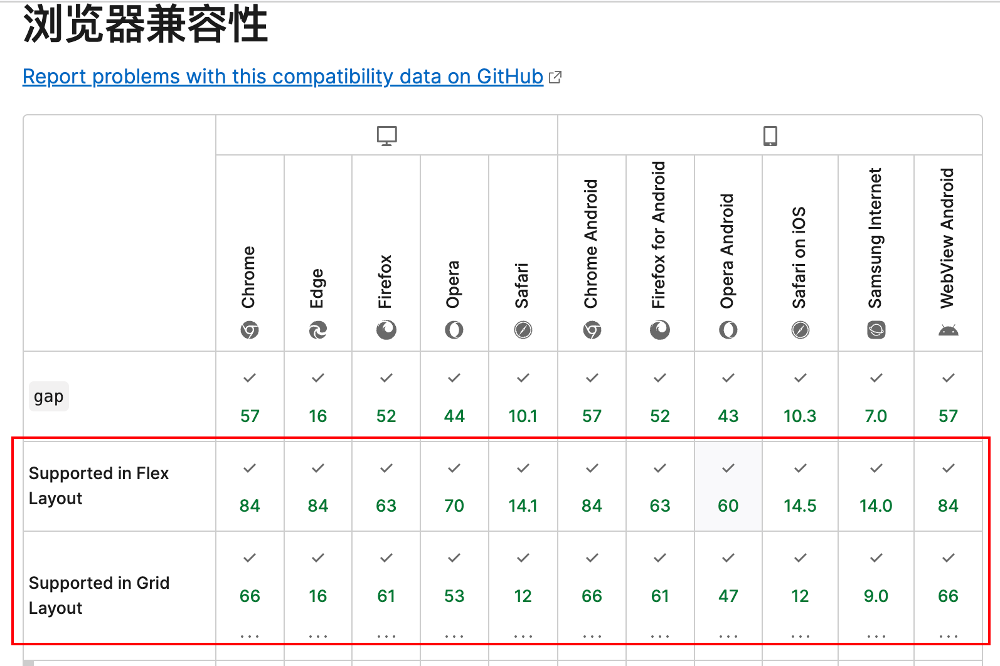

# 网格布局实现方案


> 秋天的百望山

今天我想讨论一下，怎么实现常见的网格布局：在容器中排列若干子项，让子项像在网格中一样有间距的排列在容器内，以实现如图的效果：



每个粉色格子代表一个子项，每个格子之间的间距是 10px。格子宽 250px，高 200px。蓝色边框代表容器，容器 border-width 是 10px，为了刚好容纳一行四个盒子，所以容器宽度是 1050px。

> 250 \* 4 (子项) + 10 \* 3 (列间距) + 10 \* 2 (边框) = 1050

示例代码为了更直观看到 dom 和样式的关联关系，使用 `tailwindcss` 实现。

避免示例代码重复，父子 dom 的基础样式提取出来。如下：

```ts
const containerClassName = "border-blue-500 border-[10px] w-[1050px]";

const itemClassName = "w-[250px] h-[200px] bg-red-300";
```

## 方案一：选择器 `nth-child`

为了实现每个子项的间距，我们可以通过给子项设置`margin`来实现。

但如果每个子项都设置 `margin-right` 和 `margin-bottom`是有问题的，比如每行最后一项为了贴合容器边缘，就不应该有 `margin-right`。

即最后一行和最后一列的子项会存在冗余的 `margin`，无法贴合容器边缘。



> 冗余的`margin`导致第一行第四个子项被挤下去了。

既然有冗余的 `margin`，那么我们就可以通过选择器 `nth-child` 来给最后一行和最后一列的子项设置 `margin-right` 和 `margin-bottom`为 0，来手动去除冗余的 `margin`。

实现代码

```tsx
<div className={`${containerClassName} flex flex-wrap`}>
  {arr.map((item) => (
    <div
      key={item}
      className={`${itemClassName} mr-[10px] mb-[10px] 
        [&:nth-child(4n)]:mr-0 
        [&:nth-last-child(-n+4)]:mb-0`}
    ></div>
  ))}
</div>
```

值得注意的是，这里的`n`我们可以理解成 0/1/2/3/4，所以`nth-child(4n)`表示第 4/8/12/16...个子项，也就是每行最后一个子项、或者说最后一列。

同理`nth-last-child(-n+4)`表示倒数第 4/3/2/1 个子项，即最后一行。

这种方案的优点是没什么兼容性问题。

缺点是不容易理解，而且不好维护。假如后期从每行四个改成每行五个，那改动就会比较大。

## 方案二：负数`margin`

既然给子项 `margin-right`、`margin-bottom`，会导致冗余的 `margin`，那么我们可以给子项外再包一层 `margin` 负数的容器，来抵消内部 `margin` 的冗余。

```tsx
<div className={containerClassName}>
  {/* 中间层容器，负数margin */}
  <div className="flex flex-wrap mr-[-10px] mb-[-10px]">
    {arr.map((item) => (
      <div key={item} className={`${itemClassName} mr-[10px] mb-[10px]`}></div>
    ))}
  </div>
</div>
```

这种方案同样没有兼容性问题。

缺点是，需要多一层容器，增加了 DOM 节点，而且负数的 `margin` 比较 hack，不是推荐的标准写法。

## 方案三：`grid`

grid 布局实现起来就非常方便。

```tsx
<div className={`${containerClassName} grid grid-cols-4 gap-[10px]`}>
  {arr.map((item) => (
    <div key={item} className={itemClassName}></div>
  ))}
</div>
```

这种方案的优点是，代码简单，容易理解。

缺点是，轻微的兼容性问题。grid 布局中的 gap 需要 chrome 版本 66+。

## 方案四： `flex + gap`

`flex` 布局中，`gap` 属性可以指定内部子项的间距。

```tsx
<div className={`${containerClassName} flex flex-wrap gap-[10px]`}>
  {arr.map((item) => (
    <div key={item} className={itemClassName}></div>
  ))}
</div>
```

这种方案的优点是，代码简单，容易理解。

缺点是，兼容性问题。`gap in flex`的兼容性比`grid`布局差很多。需要 chrome 版本 84+。



## 结论

`gap` 在 `grid` 布局里需要 Chrome 66+（2018 年发布），兼容性已经很好了。推荐使用。

`gap` 在 `flex` 布局里需要 Chrome 84+（2020 年发布），兼容性较差，但胜在简单，如果项目对兼容性要求不高，比如内部后台管理，推荐使用。

`nth-child` 和 负数 `margin` 的方案，兼容性好，但代码复杂，不易维护，不推荐使用。

## 呃 😓

最近为了兼容老设备,不得不把组件库中的`gap in flex` 手动改为 `margin` 😭
