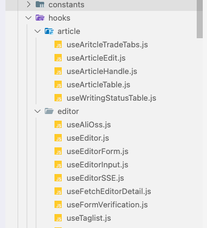

# 更专业地使用vscode

> 翻译自 [Use VS Code Like a Pro](https://javascript.plainenglish.io/use-vs-code-like-a-pro-53973daa534f)

只需些许调整，vscode就能变得更好用。

## 优化文件树

通过几行配置来让你的文件树更清晰、更有条理！

1. 打开vscode

2. 打开 Command Palette（快捷键：`Ctrl+Shift+P`）

3. 输入 `Preferences: Open Settings (JSON)`，然后回车

4. 在打开的`settings.json`文件中添加以下配置

```json
{
  "workbench.tree.indent": 15,
  "workbench.tree.renderIndentGuides": "always",
  "workbench.colorCustomizations": {
    "tree.indentGuidesStroke": "#05ef3c"
  }
}
```



> 更明显的层级关系和缩进指示器

## 升级字体：Fira Code

我推荐使用 [Fira Code](https://github.com/tonsky/FiraCode)。

该字体让抽象的符号堆叠变得更养眼且直观。项目README有中文版本。并介绍了各个操作系统的字体安装方法。


## 全新主题

推荐四个主题

**One Dark Pro**

美观的深色主题。

  

**Dracula Official**

深色主题，适合喜欢暗色系的开发者。字体更突出。

​	

**GitHub Theme**: 

适合github粉丝的主题。


**Material Icon Theme**

更清晰美观的图标主题。


