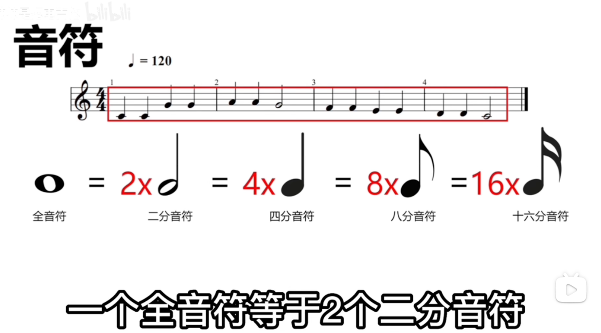
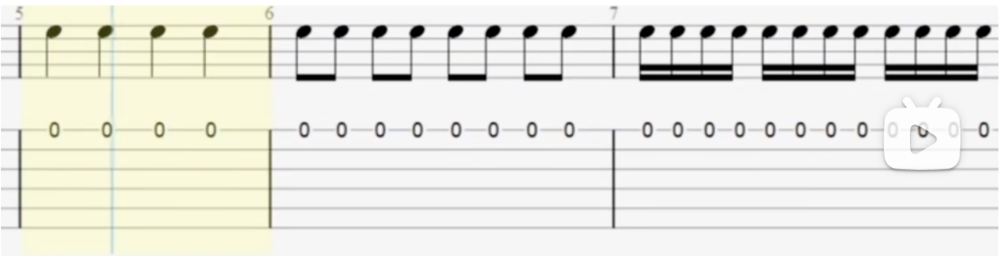
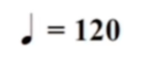
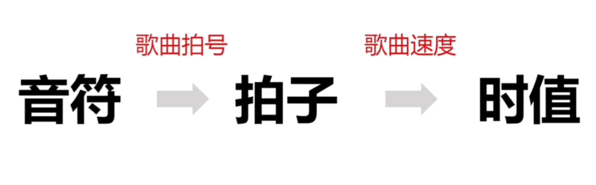
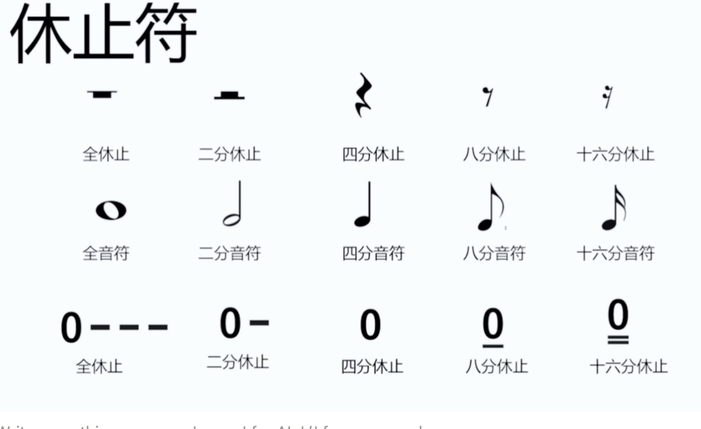

# 音符、拍子、时值、休止符

上面的音符只是单独写的样子，如果连起来八分音符有一根尾巴，十六分音符有两根尾巴

拍子： 4/4 

上面的4代表：每个小节中有多少拍

下面的4代表：一个四分音符是一拍

那一拍是多少秒呢？

意味着==120 Beat Per Minute 即120拍每分钟==，也就是一拍半秒。

所以三者关系是：

### 念节奏

八分音符： one and two and three and four

十六分音符： one e and a two e and a three e and a four e and a

### 休止符

