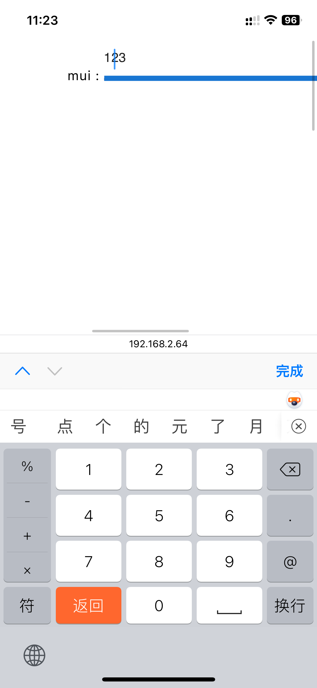

## iphone safari 的 input 光标左偏问题

### 最小复现 demo

```tsx
import { Input } from "@mui/material";
import { useEffect } from "react";

export default function MyTest() {
  useEffect(() => {
    document.documentElement.style.fontSize = "15px";
  }, []);

  return (
    <>
      raw : <input type="text" className="w-[25rem]" />
      mui : <Input className="w-[25rem]"></Input>;
    </>
  );
}
```

用 iphone 的 safari 打开该页面，input 框的光标会偏移  


### 猜测问题原因及解决方案

可能是因为根元素的字体小于 12px，越小 bug 越明显。所以解决方案就是别让 html 的字体太小。
