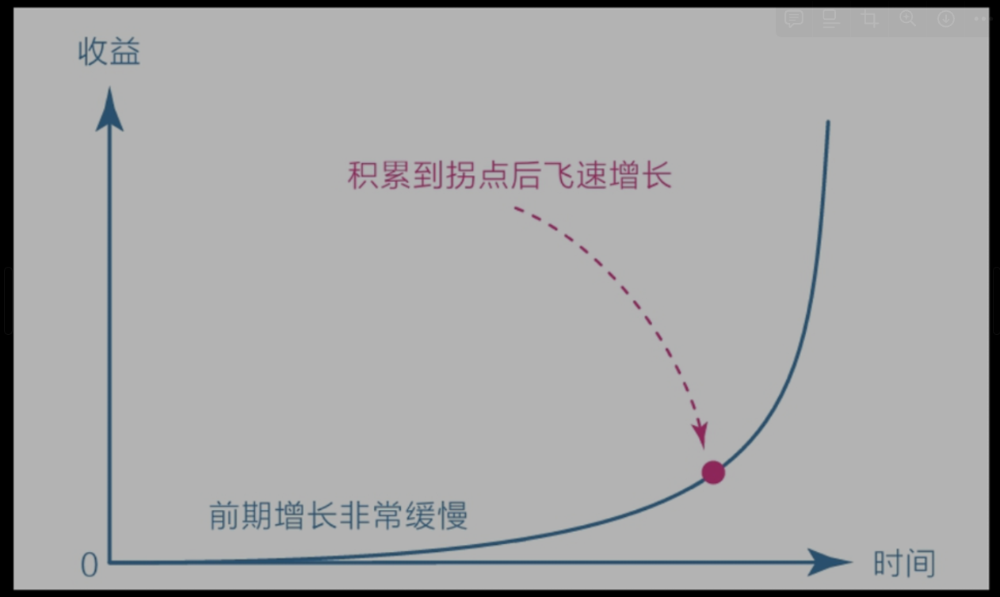
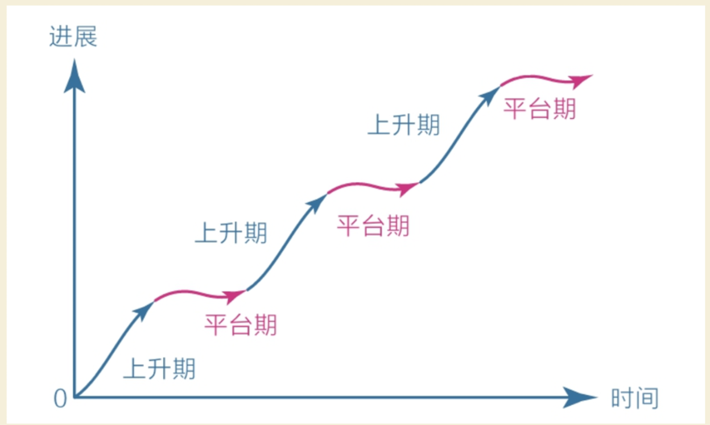
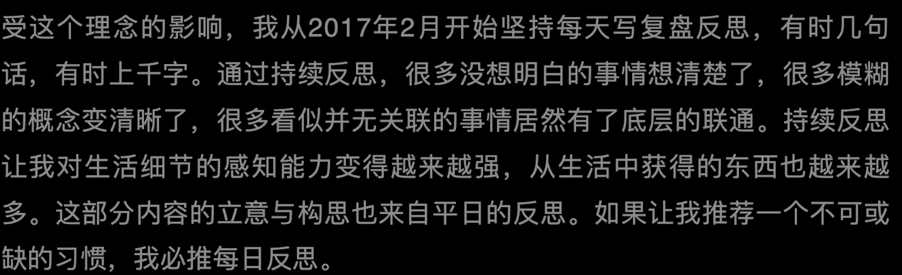
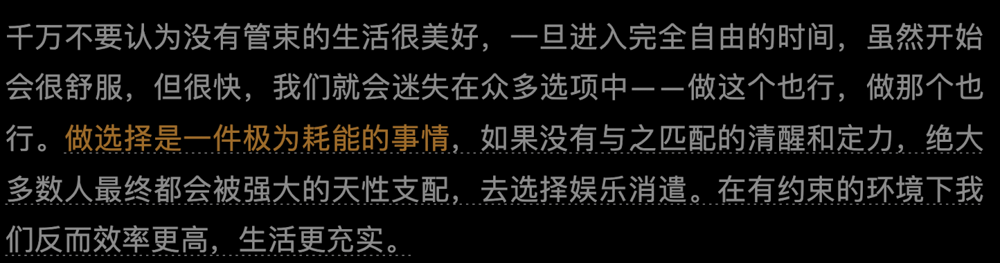

# 认知觉醒

## 三个大脑

- 本能脑 爬行动物的本能，饿了吃，困了睡
- 情绪脑 哺乳动物的情绪，远离危险，善于维护关系。行动力强
- 理智脑 理性思考，但计算缓慢，行动力弱，十分弱小

因为理智脑的弱小，我们容易进入这样的怪圈：明明知道，但做不到。特别想要，但得不到。

理智脑不是直接干活的，干活是本能脑和情绪脑的事情，因为它们的“力气”大；上天赋予理智脑智慧，是让它驱动本能和情绪，而不是直接取代它们。

## 耐心

复利曲线，被爱因斯坦称为奇迹。缺乏耐心的时候想想。

对于任何没有特殊资源的个体或群体来说，坚信并践行这个价值积累规律，早晚能有所成就。当然，前提是选择正确的方向，并在积累的过程中遵循刻意练习的原则，在舒适区边缘一点一点地扩展自己的能力范围。

改变量﹥行动量﹥思考量﹥学习量

即：学习后去思考，去行动，去改变。

## 学习平台期

学习进展和时间的关系并不是我们想象中的那种线性关系（学多少是多少），而是呈现一种波浪式上升曲线。

在平台期，我们可能付出了大量的努力，但看起来毫无进步，甚至可能退步，不过这仅仅是一个假象，因为大脑中的神经元细胞依旧在发生连接并被不停地巩固，到了某一节点后，就会进入下一个快速上升阶段。

只要你温和地与自己对话，“体内的原始人”就会愿意倾听你的意愿。

## 潜意识

负面的经历不会自己消失，而是进入潜意识影响着自己。

不让它进入潜意识的方式就是直面它，拆解它，接受它。

## 行动力

行动力不足是因为选择模糊，人类本能的在面临不确定时会选择逃避，就像站在十字路口不知往哪走。当我们没有清晰的目标和指令时，就很容易选择享乐

## 元认知

元认知我暂时理解成自我反思的能力，元认知分为主动和被动，大多数人都是被动，即只有遇到问题时才会自我审查。

### 反观：元认知的起点

你能意识到自己在想什么，进而意识到这些想法是否明智，再进一步纠正那些不明智的想法，最终做出更好的选择

元认知是：自我审视、主动控制，防止被潜意识左右的能力。

文中提到了冥想，因为冥想是有意识的控制大脑的注意力。是对元认知的锻炼。

人和人的差距不是年龄/学历/金钱,而是沉淀了多少(总结/反思/升华).

### 正确方法的四个特征

- 有明确的目标：解决行动力的问题，没有行动力通常是==目标太大太模糊==，需要对目标做拆解

- 练习时极度专注: 
  + 浅层学习是指阅读/听书等方式,这种方式只能感动自己.
  + 深层学习是指自己读书并践行/消化,形成新的知识,甚至可以给别人讲解.
  + 读完一本书,哪怕能改变自己一两点也是很了不起的.
  + 只是读完一本书的学习过程是不完整的,应该产出自己的理解(写作/反思).产出自己理解的过程要把新知识与新知识之间关联.把新观点和生活关联.

- 能获得有效反馈
  - 教是最好的学
  - 用是最好的学
  - 输出倒逼输入
  - 用作品说话: 用心的作品会收到反馈,正面反馈会激发行动力.负面反馈是指示自己努力的方向.

- 始终在拉伸区练习
  - 主动休息,随着时间精力会变少,主动休息回复休息更有效.
  - 一旦发现自己注意力不集中,就主动休息

### 做选择很累的

### 行动力

增强回路: ==最初的选择会影响行为自动增强的方向==,

> 有人说这是"因果论", "一日之计在于晨" , "好的开始是成功的一半" 所真正想表达的.

每天刚睡醒时,我们都收获了完整的精力,这时先把重要的事做了,后续就会一直顺着一直做.

如果一天开始时先娱乐了,就没有更多精力转移到重要的事上面了.

