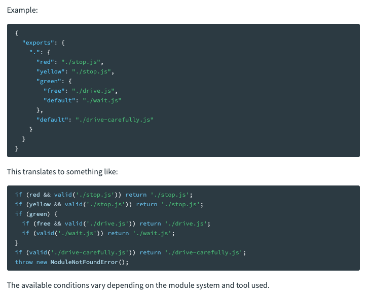

# exports/files/types

### exports

- 是[main](https://docs.npmjs.com/cli/v10/configuring-npm/package-json#main)的别名，描述模块的导出路径。优先级高于main。
- 可以为commonjs和ESmodule指定不同的入口

```json
{
  "type": "module",
  "exports": {
    ".": {
      "require": "./main.cjs",
      "default": "./main.js"
    }
  }
}
```

vue的exports

```json
"exports": {
    ".": {
      "import": {
        "types": "./dist/vue.d.mts",
        "node": "./index.mjs",
        "default": "./dist/vue.runtime.esm-bundler.js"
      },
      "require": {
        "types": "./dist/vue.d.ts",
        "node": {
          "production": "./dist/vue.cjs.prod.js",
          "development": "./dist/vue.cjs.js",
          "default": "./index.js"
        },
        "default": "./index.js"
      }
    },
    "./server-renderer": {
      "import": {
        "types": "./server-renderer/index.d.mts",
        "default": "./server-renderer/index.mjs"
      },
      "require": {
        "types": "./server-renderer/index.d.ts",
        "default": "./server-renderer/index.js"
      }
    },
   //....后面还有很长....
```

该怎么解读vue的exports呢，通过看webpack的文档我们得知



结合文档，对vue的exports字段大致的解释如下：

```tsx
if (import && types) { // 当使用ES模块导入，并且在TypeScript环境中需要类型声明
	if (requestingMainModule) { // 请求的是主模块
		return './dist/vue.d.mts'; // 返回主模块的类型声明文件
	} else if (requestingServerRenderer) { // 请求的是'server-renderer'子模块
		return './server-renderer/index.d.mts'; // 返回'server-renderer'子模块的类型声明文件
	}
} ...
```

### files

 **`files`** 字段是一个文件模式的数组，用于描述在将你的包作为依赖项安装时要包含的条目。

文件模式遵循类似于 **`.gitignore`** 的语法。如果省略默认为["*"]，即包含所有文件。

但有些文件无论是否配置了files字段都会被包含或排除。可以通过.npmignore来更具体的配置。具体参考[npm Docs](https://docs.npmjs.com/cli/v10/configuring-npm/package-json#files)

### types

用于指明类型声明文件的路径

```tsx
//vue
"types": "dist/vue.d.ts",
```

typings ? 待了解