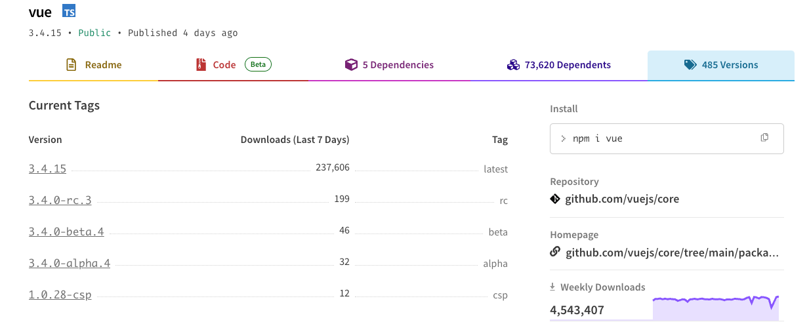
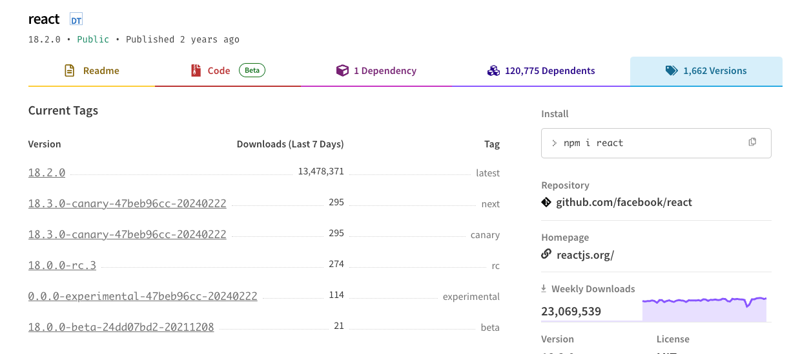

# version

### **Semver规范**

版本号应遵循semantic version规范

[semver](https://semver.org/lang/zh-CN/)  [npm Docs](https://docs.npmjs.com/about-semantic-versioning)

### **Semver简述**

标准的版本号必须采用 X.Y.Z 的格式，其中 X、Y 和 Z 为非负的整数，且禁止在数字前方补零。X 是主版本号、Y 是次版本号、而 Z 为修订号，英文对应表示为 major、minor、patch。**总结：破坏性的不兼容的变更修改主版本号（Major)，以向后兼容的方式添加功能使用修改次版本号(Minor)，修复缺陷修改修订号(Patch)**。另外还有测试版本号，在修订号后。例如1.0.0-alpha.1，表示非稳定的版本。

### **测试版本号**

一般来说，alpha表示内部测试版，beta表示公开测试版，rc（Release Candidate）表示候选版本,experimental表示实验版本（可能有更多的bug)。



> Canary发布是一种降低在生产中引入新软件版本的风险的技术，方法是在将更改推广到整个基础设施并让每个人都能使用之前，将更改缓慢地推广到一小部分用户。
> 



### 指定版本号

^ 表示只会执行不更改最左边非零数字的更新

> 这意味着，如果你指定了 **`^1.2.3`**，那么可以安装任何 **`1.x.x`** 版本，但不包括 **`2.0.0`** 版本及以上具体而言，**`^0.1.2`** 允许安装以下范围的版本：大于等于 **`0.1.2`** 且小于 **`0.2.0`** 的版本，包括 **`0.1.2`**。例如，**`0.1.3`**、**`0.1.4`**、**`0.1.5`**，一直到 **`0.1.9999`** 都是允许的。但不包括 **`0.2.0`** 及以上的版本。
> 

~ 表示修订版本号的更新

> 如果版本号是 **`~1.2.3`**，那么可以安装任何 **`1.2.x`** 版本，但不包括 **`1.3.0`** 及以上的版本
> 

还有一些其他的符号来指定版本范围 [npm Docs](https://docs.npmjs.com/cli/v8/configuring-npm/package-json#dependencies)

```json

"dependencies": {
	//表示范围
	"foo": "1.0.0 - 2.9999.9999",
	"bar": ">=1.0.2 <2.1.2",
	"baz": ">1.0.2 <=2.3.4",
	//精准要求
	"boo": "2.0.1",
	//逻辑或
	"qux": "<1.0.0 || >=2.3.1 <2.4.5 || >=2.5.2 <3.0.0",
	//指定从给定 URL 下载压缩包安装
	"asd": "http://asdf.com/asdf.tar.gz",
	[//允许1.2.x](notion://xn--1-l07a090p.2.x/)
	"til": "~1.2",
	"elf": "~1.2.3",
	//x代表任意
	"two": "2.x",
	"thr": "3.3.x",
	//总是安装最新
	"lat": "latest",
	//从本地路径安装
	"dyl": "file:../dyl"
}
```