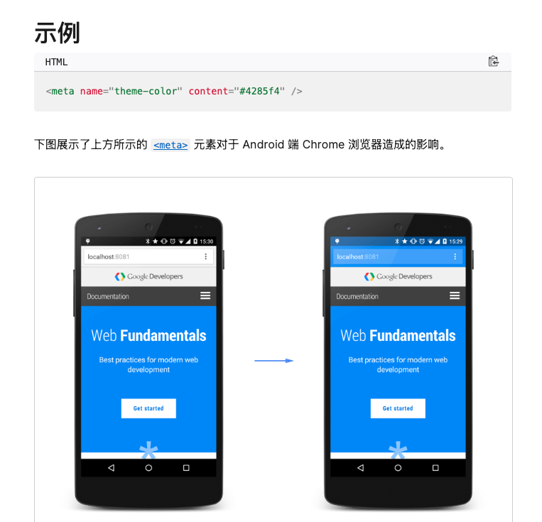

# Theme-Color

无意间用safari查看youku的网站,发现标签部分的颜色随网站的改变而改变,这种一体式的设计也太好看了.

但不是没个网站的标签部分颜色都能改变,大多数还是默认的白色.

于是很好奇,为什么youku的背景颜色不是默认的.

之前一直用chrome就没发现这个细小的设计.


查了一下,原来是meta标签.

```html
<meta name="theme-color" content="some color" />
```




